

  

  

<h1 align="center">ГУЛЯЙПОЛЕ: ВОЛЬНАЯ ТЕРРИТОРИЯ</h1>

  <b>«Анархия — мать порядка!»</b> 
  Альтернативно-исторический total conversion для <b>Hearts of Iron IV</b> · версия <b>1.3.2</b> · игра <b>1.19.*</b> 
  Языки: русский и английский

  <b>190</b> фокусов · <b>124</b> духа · <b>96</b> событий · <b>23</b> персонажа · <b>34</b> решения · <b>6</b> загрузочных экранов

---

## ⚑ Описание мода

  
   <i>Махновская конница на марше. Степь принадлежит свободным.</i>

**Гуляйполе: Вольная Территория** — альтернативно-историческая модификация для Hearts of Iron IV, возвращающая на карту мира **Вольную Территорию** — Гуляйпольскую Республику под началом **Нестора Ивановича Махно**. Крестьянские коммуны, фабричные комитеты, чёрные знамёна и легендарные тачанки: крошечная, но несгибаемая республика в причерноморских степях бросает вызов тоталитарным гигантам эпохи.

Мод добавляет полноценную страну с собственным древом национальных фокусов, персонажами, решениями, событиями, новостной лентой, музыкой, моделями войск и графикой — от портретов до загрузочных экранов и кинематографической заставки с озвучкой.

### Вольная Территория в цифрах

| | |
|---|---|
| ⭐ **Национальные фокусы** | **190** — от «Земли коммунам» до мировой революции, с вечными фокусами и честными шапками веток |
| 🖤 **Национальные духи** | **124** в 15 тематических категориях, слотовая модель апгрейдов без фарма |
| 📜 **События и новости** | **96** — летопись «Голоса Воли», дипломатия, кризисы, испанский сценарий |
| 👤 **Персонажи** | **23** с уникальными портретами: Махно, Щусь, Каретник, Задов, Кузьменко, Волин и другие |
| ⚖ **Решения** | **34** в 7 категориях, включая 12 анархических мер свободы |
|  **Заставка и меню** | нуарная заставка с озвучкой (~2:45), 6 загрузочных экранов, 9 фонов главного меню |
| 🎵 **Музыка** | 11 дорожек в духе «Монгол Шуудан» |
| 💬 **Цитаты загрузки** | более 500 авторских афоризмов: Прудон, Бакунин, Кропоткин, Махно, Волин |

### Что вас ждёт

- **Тачанки и конница** — собственные 3D-модели пехоты и кавалерии РПА, степные манёвры и рейды с риском и трофеями.
- **Дипломатия великих держав** — пакты с Москвой, Берлином и Лондоном, ультиматум Кремля, ограниченный ленд-лиз и белые волонтёры.
- **Кризисная сеть** — мятеж Григорьева, duel Задова и Волина, вопрос престолонаследия Батьки и трёхступенчатая драма белой эмиграции.
- **«Иберийский пожар»** — гражданская война в Испании: колонна Дуррути, контрабандные маршруты, Майские дни в Барселоне и **Чёрный Интернационал**.
- **Трофейные команды РПА** — побеждай в бою и захватывай винтовки, мототехнику, танки и артиллерию; при достатке резервов формируется новая дивизия «Трофейный отряд РПА».
- **Анархические меры свободы** — сходы, рабочий контроль, земля коммунам, вольная милиция, Чёрный Крест и отзыв делегатов.

  <table>
    <tr>
      <td align="center">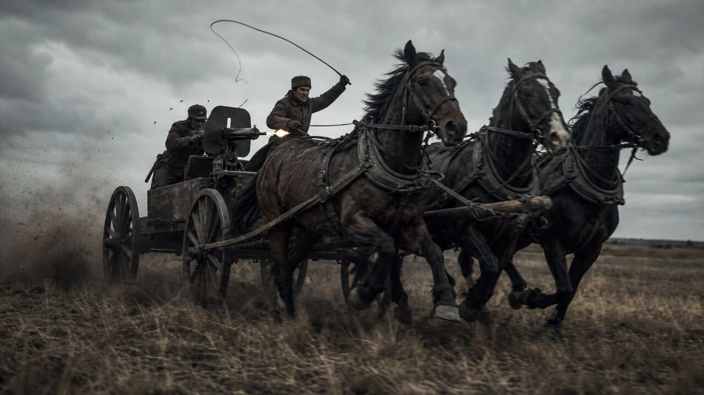 <i>Тачанка выходит в степь</i></td>
      <td align="center">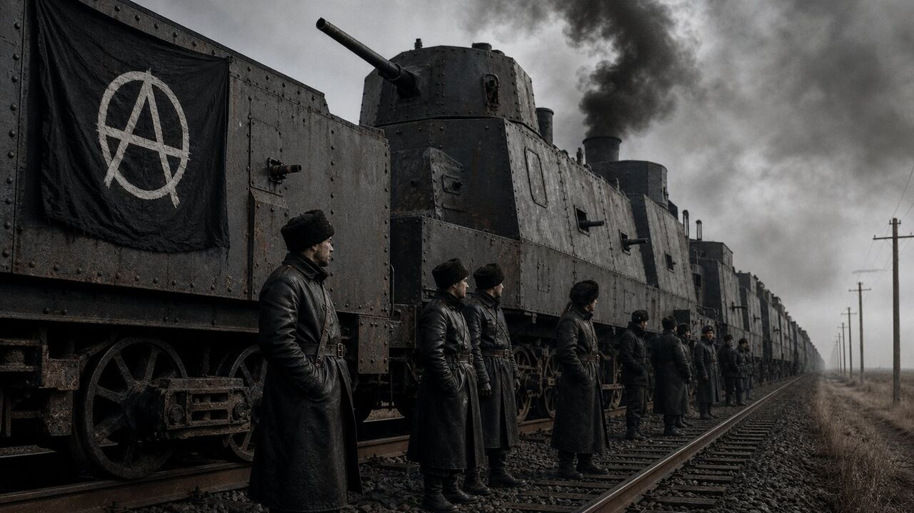 <i>Бронепоезд «Свобода или смерть»</i></td>
      <td align="center"> <i>Лихая атака Чёрной Гвардии</i></td>
    </tr>
  </table>

---

## ⚑ История

  
   <i>Ночной сход вольных коммун. Огонь свободы горит в самом сердце степи.</i>

> В реальной истории этот человек должен был сгореть от чахотки в сырой парижской эмиграции ещё в 1934 году, оставив после себя лишь горькие воспоминания о несбывшихся надеждах, изломанные тачанки и пожелтевшие страницы мемуаров. Его Вольная республика в причерноморских степях Гуляйполя была стёрта с лица земли жерновами братоубийственной бойни, не найдя себе места в мире жёстких тоталитарных империй.
>
> Но история — не прямая дорога. Это степь, где ветер может переменить направление в одно мгновение.

**На дворе 1936 год.**

В Гуляйполе чёрные знамёна вновь трепещут на холодном осеннем ветру. **Нестор Иванович Махно**, переживший свой смертный приговор, с упрямым блеском в глазах смотрит на карты охваченной кризисом Европы. Вольная Анархическая Республика возродилась из пепелища гражданской войны, окружённая со всех сторон враждебными гигантами. С севера навис индустриальный молох сталинского СССР, жаждущий исправить «ошибки прошлого». С запада и юга ползут тени фашистских и милитаристских режимов, а бывшие белогвардейцы в изгнании точат сабли в ожидании реванша.

Мир стремительно катится к новой, ещё более страшной мировой войне. И в этом котле крошечной, но несгибаемой республике предстоит сделать выбор, который потрясёт основы глобального порядка.

  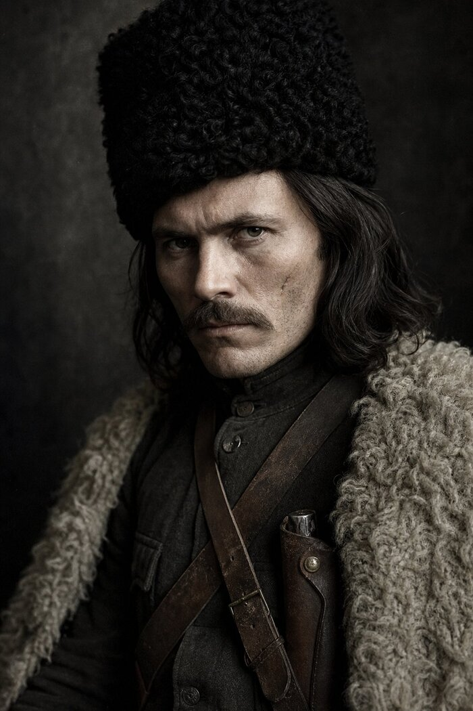
   <i>Нестор Махно, Батько Вольной Территории</i>

### Четыре дороги Вольницы

| Путь | Суть |
|---|---|
| 🕊 **Союз с прагматичным дьяволом** | Примкнуть к Германии, сыграв на противоречиях великих держав ради выживания молодой вольной коммуны. |
| ☭ **Красный реванш** | Пойти на временный, полный горькой иронии компромисс с Москвой, направив общую мощь против наступающего фашизма. |
| 🎩 **Западный вектор** | Обратиться за поддержкой к демократиям Англии и Франции, доказывая им право анархии на существование. |
|  **«Вольному — воля!»** | Отбросить все геополитические расчёты, объявить войну обоим полюсам старого мира и бросить клич по всему земному шару — под чёрные знамёна добровольцев со всех уголков планеты. |

Крестьянские тачанки снова выкатываются на просторы Дикого Поля. Пулемёты «Максим» починены, а чёрные папахи надвинуты на брови. Мир погружается во тьму, но в самом сердце степи горит огонь, который никому не удаётся потушить. **Ведите Гуляйполе к свободе — или погибните вместе с ней.**

---

## ⚑ Описание ивентов

  
   <i>Эшелоны свободы: бронепоезд РПА на степном полустанке.</i>

**96 событий** в пятнадцати сериях сплетаются в живую летопись Вольной Территории: от газетных передовиц «Голоса Воли» до тайных телеграмм великих держав и драм командного штаба РПА.

### 📰 Летопись «Голоса Воли» — новости вольной степи

Новостная лента (`glp_news`, `glp_press`) — хроника возрождения республики, оформленная широким тёмным окном новости с авторскими картинами:

- **«Возрождение вольного Гуляй-Поля»** — чёрные знамёна вновь над причерноморскими степями и Донбассом;
- **«IV Съезд вольных крестьян и рабочих»** — провозглашена Федерация Вольных Советов: земля — труженикам, заводы — фабричным комитетам;
- **«Легендарные тачанки выходят в степь»** — массовое производство пулемётных повозок в мастерских Екатеринослава;
- **«Бронепоезд "Свобода или смерть" сошёл с верфей»** — стальная крепость РПА выходит на рейс;
- **«ДнепроГЭС: степь озарена электричеством»** — ток вольным мастерским;
- **«Радиобашня "Голос Воли" начинает вещание»** — сигнал свободы покрывает Гуляйполе, Крым, Донбасс и Кавказ;
- **«Чёрная Гвардия на марше»** — всеобщая мобилизация;
- **«Севастополь: возрождение революционного флота»** и **«Чёрный Интернационал: братство с CNT-FAI»**.

  <table>
    <tr>
      <td align="center">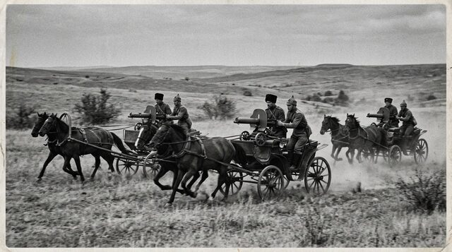 <i>Тачанки выходят в степь</i></td>
      <td align="center">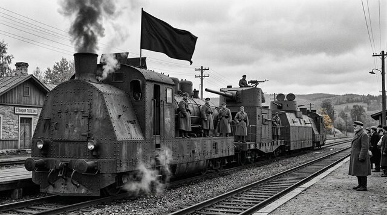 <i>Бронепоезд сошёл с верфей</i></td>
      <td align="center">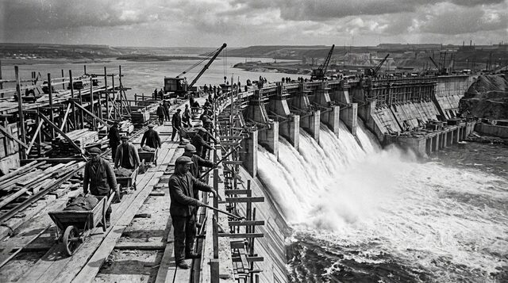 <i>ДнепроГЭС даёт ток</i></td>
    </tr>
    <tr>
      <td align="center">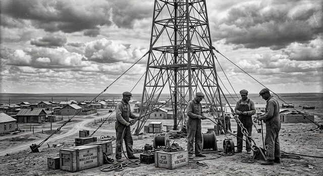 <i>«Голос Воли» в эфире</i></td>
      <td align="center">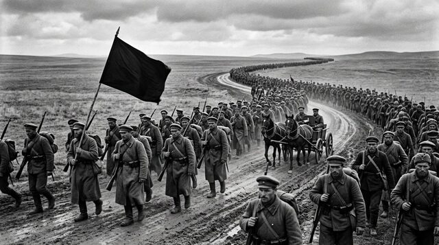 <i>Чёрная Гвардия на марше</i></td>
      <td align="center">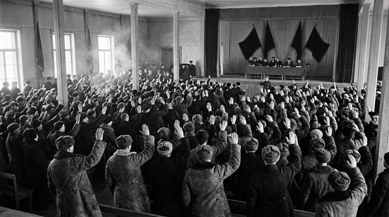 <i>Съезд вольной мысли</i></td>
    </tr>
  </table>

### 🔥 Будни Вольницы — советы, коммуны, рейды

Серия `glp` — пульс повседневной жизни республики: **Совет Революционного Военного Комитета**, **сходы вольных коммун**, степные манёвры тачаночных отрядов, угольные синдикаты Донбасса, великая осенняя ярмарка, эскадрилья **«Чёрный буревестник»**, контрразведка Задова, накрывающая агентурные сети, и делегации CNT-FAI, прибывающие в Гуляйполе.

### 🌍 Дипломатия великих держав

Серии `glp_diplo` и `glp_powers` — большая игра вокруг степи:

- **«Ультиматум Москвы»** (окно 1936.3–1938.6): дань или отказ — и Кремль точит косу;
- **«Харьковский пакт II»** и танковые эшелоны из Харькова;
- **«Эмиссары из Берлина: предложение Абвера»** и эшелоны Круппа на станции Пологи;
- **«Атташе Форин-Офиса в Гуляйполе»** и караван из Ливерпуля;
- развязки: **«Ось в Причерноморье»**, **«Антанта у Перекопа»** или гордое **«Вольному воля»**.

Каждый пакт исполняется событиями партнёров с реакцией соседей; отказ оборачивается годом «Изоляционного сопротивления».

### ⚡ Кризисная сеть — драма внутри Вольницы

Серия `glp_crisis` — десять событий, где свобода проверяется на прочность изнутри:

- **«Григорьев ломает строй»** — четыре развязки: лояльность, мятеж, казнь или примирение;
- **«Задов против Волина»** — сталь контрразведки против идеологии свободы;
- **«Кровь на платке Батьки»** — вопрос престолонаследия: лазарет, седло, **Совет Атаманов** или Вольница без Батьки; в совете — три кандидата: Вдовиченко, Белаш, Волин;
- **белые эмигранты в три ступени**: разоружение → эмиграция или «параллельный штаб» → развязка в степи.

### 🇪🇸 Иберийский пожар и Чёрный Интернационал

  
   <i>1936, Иберия: набат Гуляйполя слышен за Пиренеями.</i>

Серии `glp_spain`, `glp_spain2`, `glp_barcelona` — гражданская война в Испании глазами вольной степи:

- **«Испанский пожар»** — три курса помощи братьям: полный (бригада РПАУ и дух добровольцев), тайный или отказ «Набат замолк»;
- **контрабандные маршруты с риском**: Черноморский прорыв (65%), Балканы (85%), Пиренеи (95%);
- **колонна Дуррути** — первый контакт, «Лев Арагона», гибель героя и арагонский коллектив;
- **«Майские дни в Барселоне»** — спецгруппа КРО Задова способна изменить исход: власть синдикатов → **Черноморско-Иберийский пакт** и фракция «Чёрный Интернационал»;
- **Андрес Нин**: загнанный лидер, спасение или судьба; **Эмма Гольдман в Гуляйполе**; **Конгресс Чёрного Интернационала**; **«Франко у ворот»** и испанские беженцы в степи.

  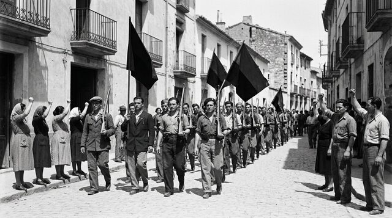
   <i>Интернационалисты держат Мадрид. Братство чёрных знамён двух континентов.</i>

### 🏆 Трофейные команды РПА

Побеждай в бою — и степь вооружит тебя: 50% шанс трофейного стрелкового вооружения, 25% — мототехники, 8% — танков и артиллерии. При людских резервах и запасе вооружения на контролируемой территории формируется новая дивизия **«Трофейный отряд РПА»** с ремонтной ротой.

---

## ⚑ Персонажи и командиры

23 фиксированных персонажа с собственными портретами — от Батьки до начальников штаба и разведки. Чистые портреты без значков, как в старой фотокарточке.

  <table>
    <tr>
      <td align="center">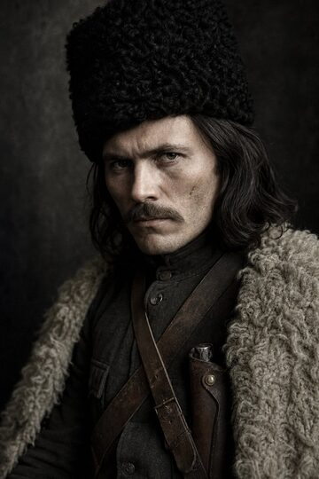 <b>Нестор Махно</b> <i>Батько Вольницы</i></td>
      <td align="center">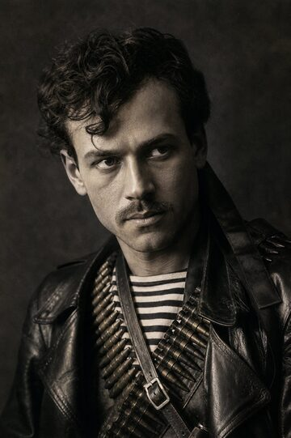 <b>Феодосий Щусь</b> <i>Гроза рейдов</i></td>
      <td align="center">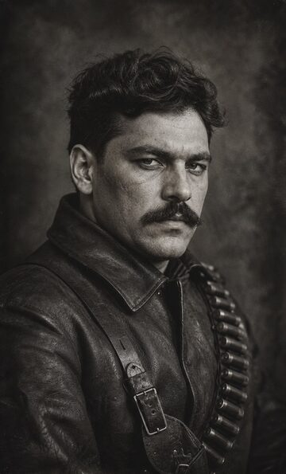 <b>Лев Задов</b> <i>Контрразведка КРО</i></td>
      <td align="center">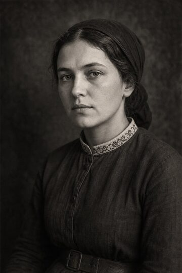 <b>Галина Кузьменко</b> <i>Соратница Батьки</i></td>
    </tr>
    <tr>
      <td align="center">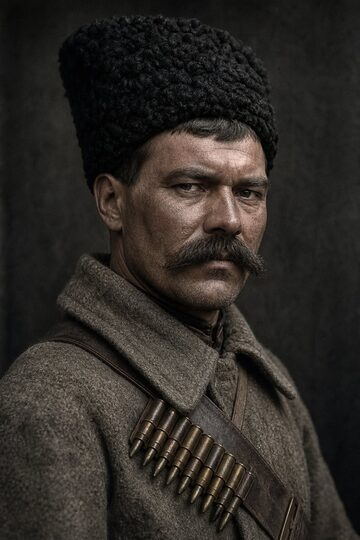 <b>Семён Каретник</b> <i>Командир кавалерии</i></td>
      <td align="center">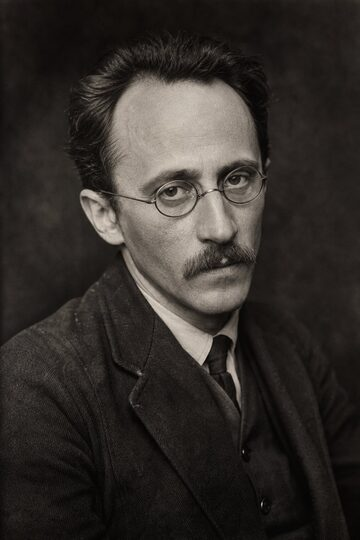 <b>Всеволод Волин</b> <i>Идеолог свободы</i></td>
      <td align="center">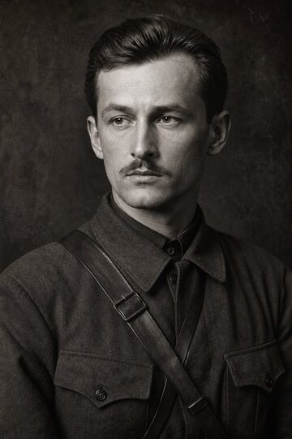 <b>Виктор Белаш</b> <i>Начальник штаба</i></td>
      <td align="center">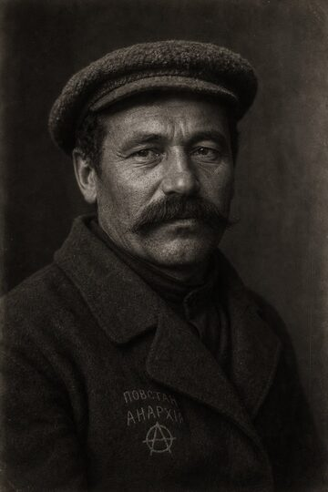 <b>Трофим Вдовиченко</b> <i>Партизанский вождь</i></td>
    </tr>
  </table>

---

## ⚑ Установка и требования

1. **Hearts of Iron IV версии 1.19.\***
2. **Обязательно DLC «La Résistance»** — лидер Махно задан с идеологией `anarchism`, которая существует только в этом DLC; без него игра не загрузит сценарий.
3. Скопируйте папку мода в каталог модов HOI4 или установите через лаунчер Paradox, включите мод и нажмите **«Вольному воля!»**.

---

## ⚑ Галерея

  <table>
    <tr>
      <td align="center">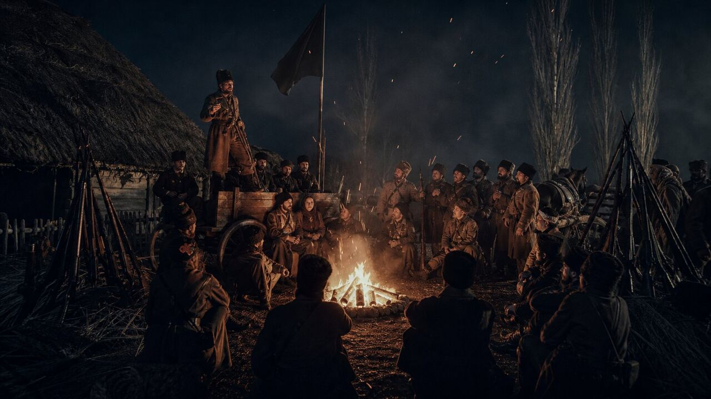 <i>Совет у костра</i></td>
      <td align="center">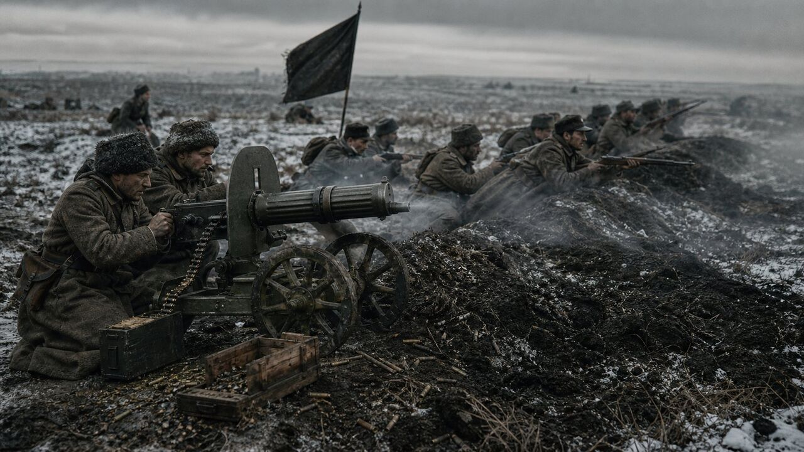 <i>Пулемётная линия РПА</i></td>
      <td align="center">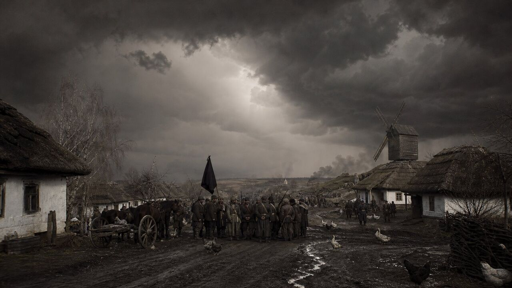 <i>Гроза над вольным селом</i></td>
    </tr>
    <tr>
      <td align="center">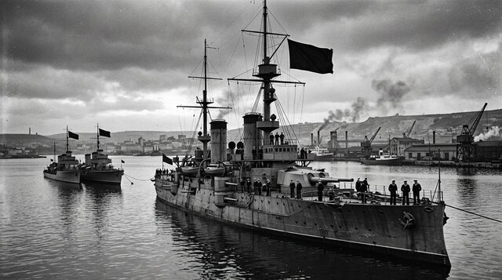 <i>Севастополь: революционный флот</i></td>
      <td align="center"> <i>Батько говорит с вольницей</i></td>
      <td align="center">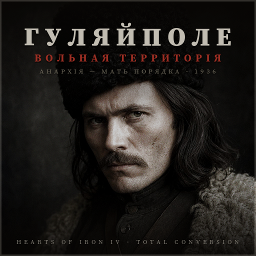 <i>Карточка мода</i></td>
    </tr>
  </table>

---

## ⚑ Разработчикам

- [`AUDIT_REPORT.md`](AUDIT_REPORT.md) — полный аудит: синтаксис, дубли, локализация, спрайты, геометрия, анти-фарм (`tools/glp_audit.py`, код возврата 1 при ошибках).
- [`GAMEPLAY_READINESS.md`](GAMEPLAY_READINESS.md) — боеготовность и баланс.
- [`ICONS_REPORT.md`](ICONS_REPORT.md) — отчёт по иконкам фокусов и духов.
- [`CINEMATIC_INTRO_README.md`](CINEMATIC_INTRO_README.md) — кинематографическая заставка и озвучка.
- [`THIRD_PARTY_ASSETS.md`](THIRD_PARTY_ASSETS.md) — сторонние ассеты и лицензии.
- [`next.md`](next.md) — планы развития.
- `mod_page/` — HTML-страница мода с галереей и предисторией.
- Инструменты: `tools/glp_audit.py`, `tools/assign_focus_filters.py`, `tools/sync_focus_headers.py`, `tools/build_portraits.sh`, `tools/build_spirit_icons.sh`, `tools/build_thumbnail.sh`, `tools/build_screens.sh`, `tools/build_event_pictures.sh`.

Структура мода: `common/` (фокусы, идеи, персонажи, решения) · `events/` (события и новостная лента) · `gfx/` (флаги, портреты, экраны, иконки) · `history/` (история страны, OOB, стейты) · `interface/` (GUI-оверрайды) · `localisation/` (RU/EN, UTF-8 BOM) · `music/` и `sound/`.

---

  <b>Вольному — воля!</b> 
  <i>Мир погружается во тьму, но в самом сердце степи горит огонь, который никому не удаётся потушить.</i>

