

  <i>Данная модификация носит исключительно развлекательный характер. Всё происходящее в ней — вымысел, не пропагандирующий никакие политические или идеологические взгляды. Единственная цель мода — позволить игроку исследовать фантастические альтернативные сценарии «А что если...».</i>

---

  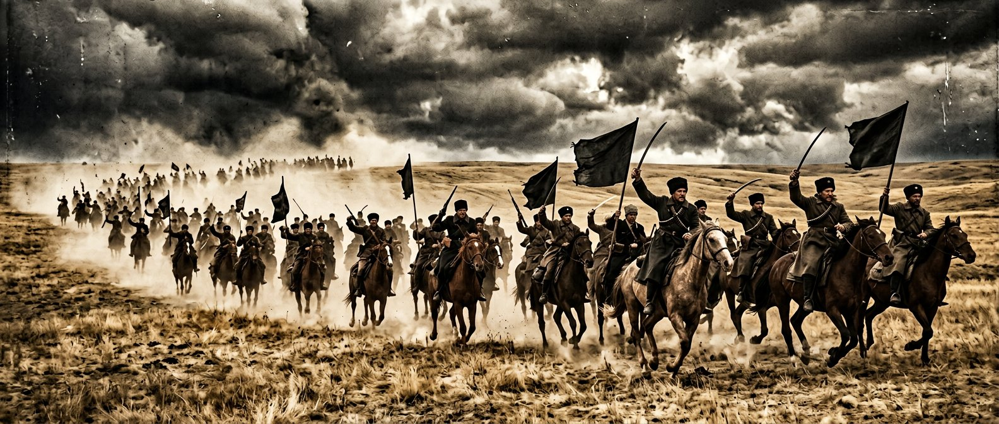

  

<h1 align="center">ГУЛЯЙПОЛЕ: ВОЛЬНАЯ ТЕРРИТОРИЯ</h1>

  <b>«Анархия — мать порядка!»</b> 
  Глобальная модификация для Hearts of Iron IV · версия 1.5.0 · игра 1.19.* 
  <b>Альтернативная история</b> · языки: русский и английский 
  Разработчик — <b>wavez</b>

  190 фокусов · 124 духа · 99 событий · 34 персонажа · 34 решения · 6 загрузочных экранов

---

## ⚑ О модификации

  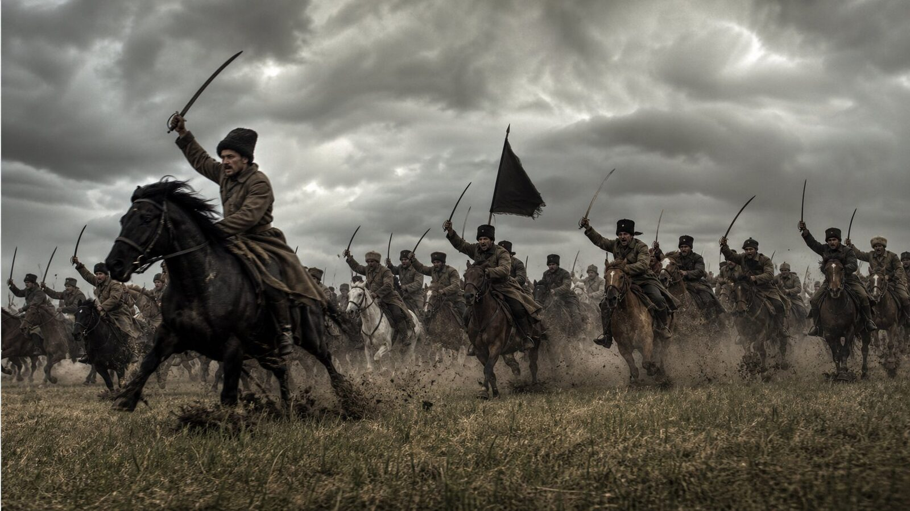 
  <i>Махновская конница на марше. Степь принадлежит свободным.</i>

**«Гуляйполе: Вольная Территория»** — глобальная модификация для Hearts of Iron IV, возвращающая на карту Вольную Территорию: Гуляйпольскую Республику под началом Нестора Ивановича Махно. Это **альтернативная история**: крестьянские коммуны, фабричные комитеты, чёрные знамёна и легендарные тачанки снова выходят на просторы Дикого Поля, и крошечная, но несгибаемая республика бросает вызов тоталитарным гигантам эпохи.

Модификация добавляет полноценную страну: собственное древо национальных фокусов, персонажей, решения, события, новостную ленту, музыку, модели войск и графику — от портретов до загрузочных экранов и кинематографической заставки с озвучкой.

### Вольная Территория в цифрах

| | |
|---|---|
| ⭐ Национальные фокусы | **190** — от «Земли коммунам» до мировой революции; вечные фокусы и честные шапки веток |
| 🖤 Национальные духи | **124** в пятнадцати тематических категориях; слотовая модель развития без фарма |
| 📜 События и новости | **99** — летопись «Голоса Воли», дипломатия великих держав, кризисы, испанский сценарий |
| 👤 Персонажи | **30** с уникальными портретами: Махно, Щусь, Каретник, Задов, Кузьменко, Волин, Аршинов, Никифорова, Барон, Озеров, Попов, Антони и другие |
| ⚖️ Решения | **34** в семи категориях, включая двенадцать анархических мер свободы |
| 🎬 Заставка и меню | нуарная заставка с озвучкой (около двух с половиной минут), шесть загрузочных экранов, девять фонов главного меню |
| 🎵 Музыка | одиннадцать дорожек в духе «Монгол Шуудан» |
| 💬 Цитаты загрузки | более пятисот авторских афоризмов: Прудон, Бакунин, Кропоткин, Махно, Волин |

### Что вас ждёт

- **Тачанки и конница** — собственные трёхмерные модели пехоты и кавалерии РПА, степные манёвры и рейды с риском и трофеями.
- **Дипломатия великих держав** — пакты с Москвой, Берлином и Лондоном, ультиматум Кремля, ограниченный ленд-лиз и белые волонтёры.
- **Кризисная сеть** — мятеж Григорьева, противостояние Задова и Волина, вопрос преемника Батьки и трёхступенчатая драма белой эмиграции.
- **«Иберийский пожар»** — гражданская война в Испании: колонна Дуррути, контрабандные маршруты, майские дни в Барселоне и Чёрный Интернационал.
- **Трофейные команды РПА** — побеждайте в бою и захватывайте винтовки, мототехнику, танки и артиллерию; при достатке резервов формируется новая дивизия «Трофейный отряд РПА».
- **Анархические меры свободы** — сходы, рабочий контроль, земля коммунам, вольная милиция, Чёрный Крест и отзыв делегатов.

<table>
<tr>
<td align="center" width="33%"> <i>Тачанка выходит в степь</i></td>
<td align="center" width="33%"> <i>Бронепоезд «Свобода или смерть»</i></td>
<td align="center" width="33%"> <i>Лихая атака Чёрной Гвардии</i></td>
</tr>
</table>

---

## ⚑ История

  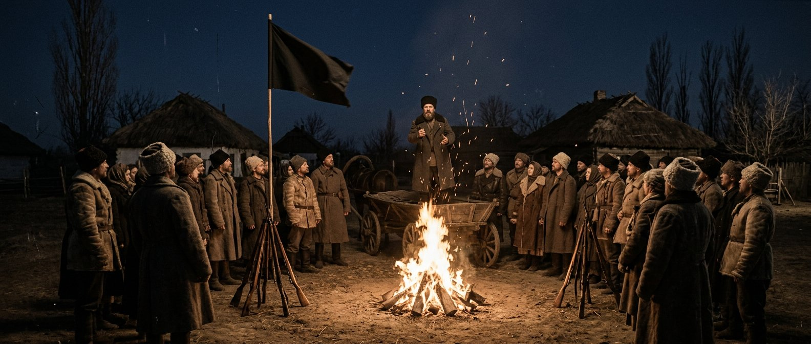 
  <i>Ночной сход вольных коммун. Огонь свободы горит в самом сердце степи.</i>

> В реальной истории этот человек должен был сгореть от чахотки в сырой парижской эмиграции ещё в 1934 году, оставив после себя лишь горькие воспоминания о несбывшихся надеждах, изломанные тачанки и пожелтевшие страницы мемуаров. Его Вольная республика в причерноморских степях Гуляйполя была стёрта с лица земли жерновами братоубийственной бойни, не найдя себе места в мире жёстких тоталитарных империй.
>
> Но история — не прямая дорога. Это степь, где ветер может переменить направление в одно мгновение.

**На дворе 1936 год.**

В Гуляйполе чёрные знамёна вновь трепещут на холодном осеннем ветру. **Нестор Иванович Махно**, переживший собственный смертный приговор, с упрямым блеском в глазах смотрит на карты охваченной кризисом Европы. Вольная анархистская республика возродилась из пепелища гражданской войны, окружённая со всех сторон враждебными гигантами. С севера навис индустриальный молох сталинского СССР, жаждущий исправить «ошибки прошлого». С запада и юга ползут тени фашистских и милитаристских режимов, а бывшие белогвардейцы в изгнании точат сабли в ожидании реванша.

Мир стремительно катится к новой, ещё более страшной мировой войне. И в этом котле крошечной, но несгибаемой республике предстоит сделать выбор, который потрясёт основы глобального порядка.

  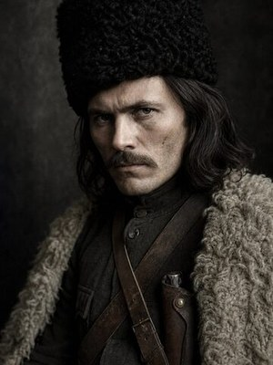 
  <i>Нестор Махно, Батько Вольной Территории</i>

### Четыре дороги Вольницы

| Путь | Суть |
|---|---|
| 🕊️ Союз с прагматичным дьяволом | Примкнуть к Германии, сыграв на противоречиях великих держав ради выживания молодой вольной коммуны. |
| ☭ Красный реванш | Пойти на временный, полный горькой иронии компромисс с Москвой, направив общую мощь против наступающего фашизма. |
| 🎩 Западный вектор | Обратиться за поддержкой к демократиям Англии и Франции, доказывая им право анархии на существование. |
| 🖤 «Вольному — воля!» | Отбросить все геополитические расчёты, объявить войну обоим полюсам старого мира и бросить клич по всему земному шару — под чёрные знамёна добровольцев со всех уголков планеты. |

Крестьянские тачанки снова выкатываются на просторы Дикого Поля. Пулемёты «Максим» починены, а чёрные папахи надвинуты на брови. Мир погружается во тьму, но в самом сердце степи горит огонь, который никому не удаётся потушить. **Ведите Гуляйполе к свободе — или погибните вместе с ней.**

---

## ⚑ События

  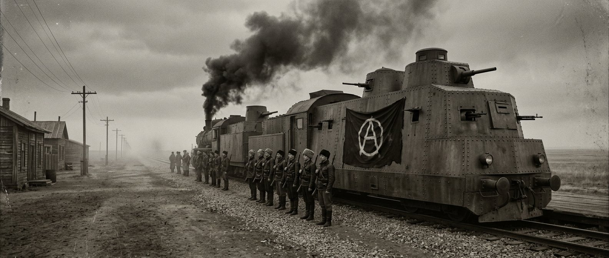 
  <i>Эшелоны свободы: бронепоезд РПА на степном полустанке.</i>

**Девяносто шесть событий** в пятнадцати сериях сплетаются в живую летопись Вольной Территории: от газетных передовиц «Голоса Воли» до тайных телеграмм великих держав и драм командного штаба РПА.

### 📰 Летопись «Голоса Воли» — новости вольной степи

Новостная лента — хроника возрождения республики, оформленная широким тёмным окном новости с авторскими картинами:

- **«Возрождение вольного Гуляй-Поля»** — чёрные знамёна вновь над причерноморскими степями и Донбассом;
- **«IV Съезд вольных крестьян и рабочих»** — провозглашена Федерация Вольных Советов: земля — труженикам, заводы — фабричным комитетам;
- **«Легендарные тачанки выходят в степь»** — массовое производство пулемётных повозок в мастерских Екатеринослава;
- **«Бронепоезд „Свобода или смерть“ сошёл с верфей»** — стальная крепость РПА выходит в рейс;
- **«ДнепроГЭС: степь озарена электричеством»** — ток вольным мастерским;
- **«Радиобашня „Голос Воли“ начинает вещание»** — сигнал свободы покрывает Гуляйполе, Крым, Донбасс и Кавказ;
- **«Чёрная Гвардия на марше»** — всеобщая мобилизация;
- **«Севастополь: возрождение революционного флота»** и **«Чёрный Интернационал: братство с CNT-FAI»**.

<table>
<tr>
<td align="center" width="33%">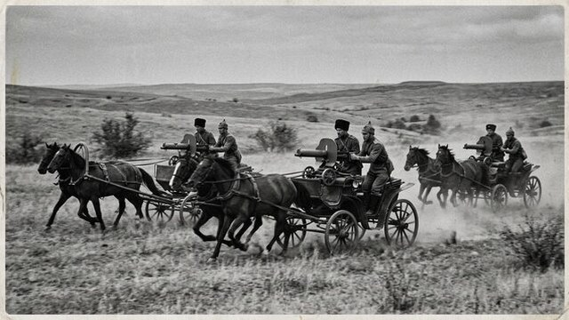 <i>Тачанки выходят в степь</i></td>
<td align="center" width="33%">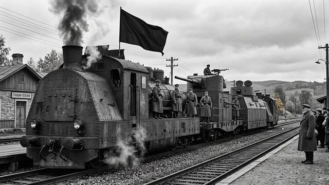 <i>Бронепоезд сошёл с верфей</i></td>
<td align="center" width="33%"> <i>ДнепроГЭС даёт ток</i></td>
</tr>
<tr>
<td align="center" width="33%">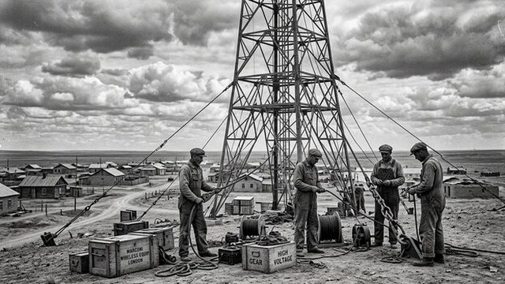 <i>«Голос Воли» в эфире</i></td>
<td align="center" width="33%">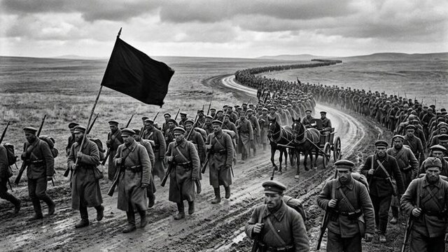 <i>Чёрная Гвардия на марше</i></td>
<td align="center" width="33%">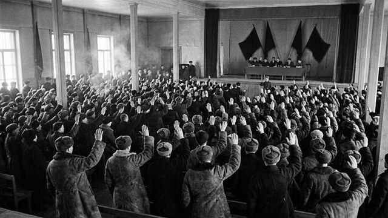 <i>Съезд вольной мысли</i></td>
</tr>
</table>

### 🔥 Будни Вольницы — советы, коммуны, рейды

Первая серия событий — пульс повседневной жизни республики: **Совет Революционного Военного Комитета**, **сходы вольных коммун**, степные манёвры тачаночных отрядов, угольные синдикаты Донбасса, великая осенняя ярмарка, эскадрилья **«Чёрный буревестник»**, контрразведка Задова, накрывающая агентурные сети, и делегации CNT-FAI, прибывающие в Гуляйполе.

### 🌍 Дипломатия великих держав

Большая игра вокруг степи:

- **«Ультиматум Москвы»** (окно: март 1936 — июнь 1938): дань или отказ — и Кремль точит косу;
- **«Харьковский пакт II»** и танковые эшелоны из Харькова;
- **«Эмиссары из Берлина: предложение Абвера»** и эшелоны Круппа на станции Пологи;
- **«Атташе Форин-офиса в Гуляйполе»** и караван из Ливерпуля;
- развязки: **«Ось в Причерноморье»**, **«Антанта у Перекопа»** или гордое **«Вольному воля»**.

Каждый пакт исполняется событиями партнёров с реакцией соседей; отказ оборачивается годом «Изоляционного сопротивления».

### ⚡ Кризисная сеть — драма внутри Вольницы

Десять событий, в которых свобода проверяется на прочность изнутри:

- **«Григорьев ломает строй»** — четыре развязки: лояльность, мятеж, казнь или примирение;
- **«Задов против Волина»** — сталь контрразведки против идеологии свободы;
- **«Кровь на платке Батьки»** — вопрос преемника: лазарет, седло, **Совет Атаманов** или Вольница без Батьки; в совете три кандидата — Вдовиченко, Белаш и Волин;
- **белые эмигранты в три ступени**: разоружение, затем эмиграция или «параллельный штаб», и наконец развязка в степи.

### Иберийский пожар и Чёрный Интернационал

  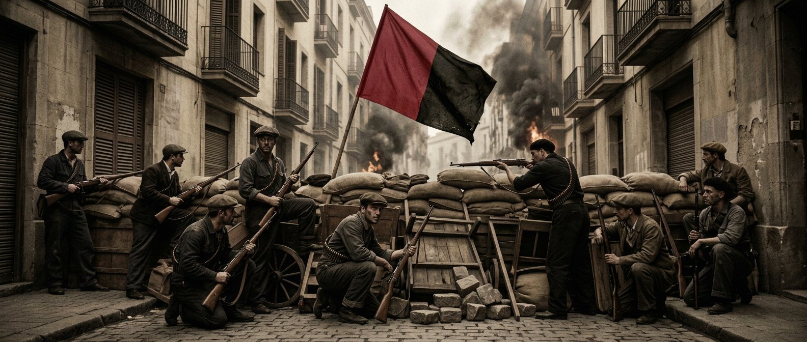 
  <i>1936 год, Иберия: набат Гуляйполя слышен за Пиренеями.</i>

Гражданская война в Испании глазами вольной степи:

- **«Испанский пожар»** — три курса помощи братьям: полный (бригада РПАУ и дух добровольцев), тайный или отказ «Набат замолк»;
- **контрабандные маршруты с риском**: черноморский прорыв (65 %), Балканы (85 %), Пиренеи (95 %);
- **колонна Дуррути** — первый контакт, «Лев Арагона», гибель героя и арагонский коллектив;
- **майские дни в Барселоне** — спецгруппа КРО Задова способна изменить исход: власть синдикатов ведёт к Черноморско-Иберийскому пакту и фракции «Чёрный Интернационал»;
- **Андрес Нин** — загнанный лидер, спасение или судьба; **Эмма Гольдман в Гуляйполе**; **Конгресс Чёрного Интернационала**; **«Франко у ворот»** и испанские беженцы в степи.

  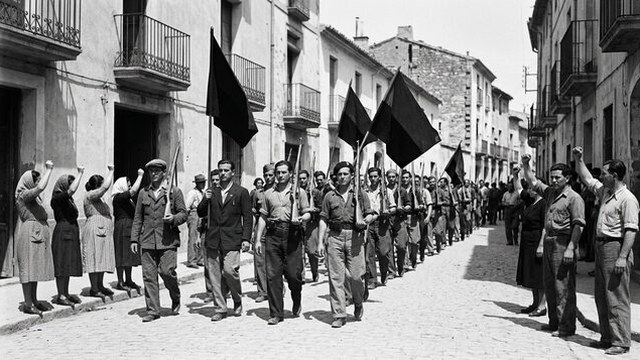 
  <i>Интернационалисты держат Мадрид. Братство чёрных знамён Гуляйполя и Иберии.</i>

### 🏆 Трофейные команды РПА

Побеждайте в бою — и степь вооружит вас: шанс трофейного стрелкового вооружения — 50 %, мототехники — 25 %, танков и артиллерии — 8 %. При людских резервах и запасе вооружения на контролируемой территории формируется новая дивизия **«Трофейный отряд РПА»** с ремонтной ротой.

---

## ⚑ Персонажи и командиры

Тридцать фиксированных персонажей с собственными портретами — от Батьки до начальников штаба и разведки. Портреты чистые, без значков, — как старая фотокарточка.

<table>
<tr>
<td align="center" width="25%"> <b>Нестор Махно</b> <i>Батько Вольницы</i></td>
<td align="center" width="25%">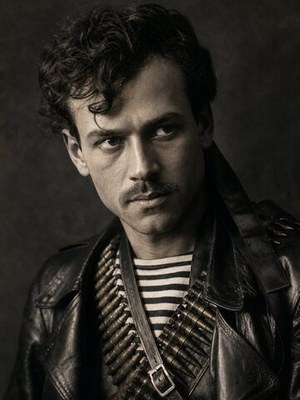 <b>Феодосий Щусь</b> <i>Гроза рейдов</i></td>
<td align="center" width="25%">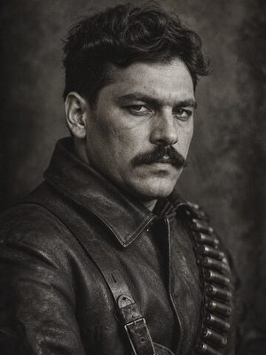 <b>Лев Задов</b> <i>Контрразведка КРО</i></td>
<td align="center" width="25%">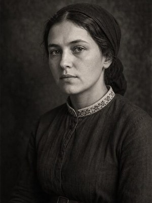 <b>Галина Кузьменко</b> <i>Соратница Батьки</i></td>
</tr>
<tr>
<td align="center" width="25%">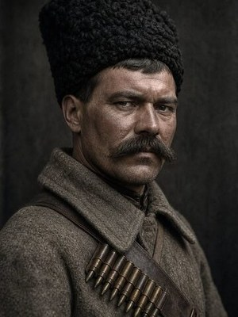 <b>Семён Каретник</b> <i>Командир кавалерии</i></td>
<td align="center" width="25%">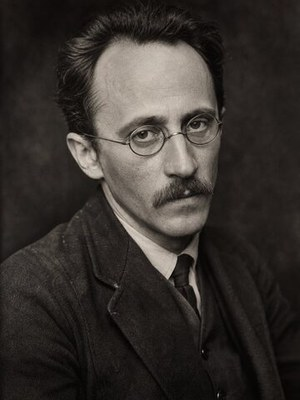 <b>Всеволод Волин</b> <i>Идеолог свободы</i></td>
<td align="center" width="25%">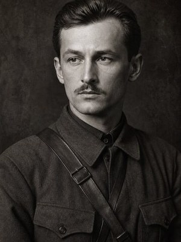 <b>Виктор Белаш</b> <i>Начальник штаба</i></td>
<td align="center" width="25%">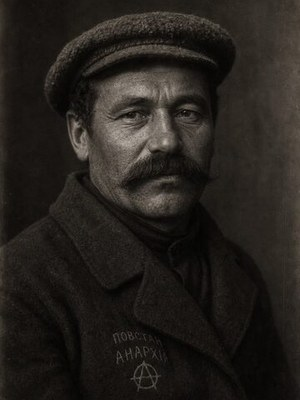 <b>Трофим Вдовиченко</b> <i>Партизанский вождь</i></td>
</tr>
</table>

---

## ⚑ Установка и требования

1. **Hearts of Iron IV версии 1.19.\***
2. **Обязательно дополнение «La Résistance»**: лидер Махно задан с идеологией анархизма, которая существует только в этом дополнении; без него игра не загрузит сценарий.
3. Скопируйте папку модификации в каталог модов HOI4 или установите её через лаунчер Paradox, включите мод и нажмите **«Вольному воля!»**.

---

## ⚑ Галерея

<table>
<tr>
<td align="center" width="33%"> <i>Совет у костра</i></td>
<td align="center" width="33%"> <i>Пулемётная линия РПА</i></td>
<td align="center" width="33%">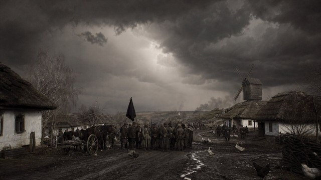 <i>Гроза над вольным селом</i></td>
</tr>
<tr>
<td align="center" width="33%">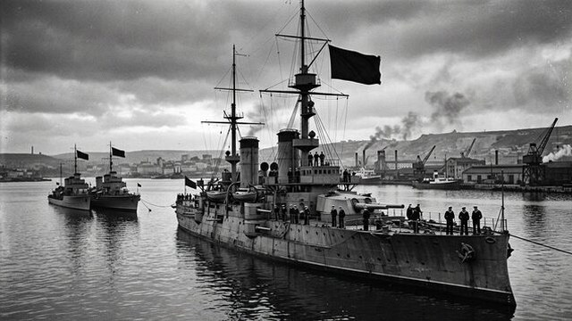 <i>Севастополь: революционный флот</i></td>
<td align="center" width="33%">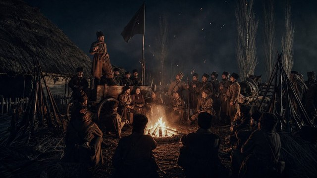 <i>Батько говорит с вольницей</i></td>
<td align="center" width="33%">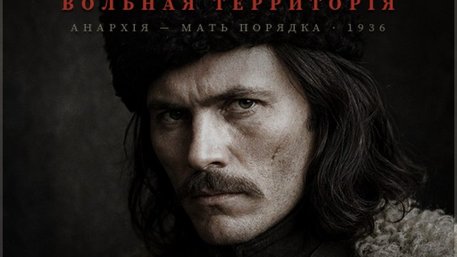 <i>Карточка модификации</i></td>
</tr>
</table>

---

## ⚑ Разработчикам

- [`AUDIT_REPORT.md`](AUDIT_REPORT.md) — полный аудит: синтаксис, дубликаты, локализация, спрайты, геометрия, защита от фарма (`tools/glp_audit.py`, код возврата 1 при ошибках).
- [`GAMEPLAY_READINESS.md`](GAMEPLAY_READINESS.md) — боеготовность и баланс.
- [`ICONS_REPORT.md`](ICONS_REPORT.md) — отчёт по иконкам фокусов и духов.
- [`CINEMATIC_INTRO_README.md`](CINEMATIC_INTRO_README.md) — кинематографическая заставка и озвучка.
- [`THIRD_PARTY_ASSETS.md`](THIRD_PARTY_ASSETS.md) — сторонние материалы и лицензии.
- [`next.md`](next.md) — планы развития.
- `mod_page/` — страница модификации с галереей и предысторией.
- Инструменты: `tools/glp_audit.py`, `tools/assign_focus_filters.py`, `tools/sync_focus_headers.py`, `tools/build_portraits.sh`, `tools/build_spirit_icons.sh`, `tools/build_thumbnail.sh`, `tools/build_screens.sh`, `tools/build_event_pictures.sh`.

Структура модификации: `common/` (фокусы, идеи, персонажи, решения) · `events/` (события и новостная лента) · `gfx/` (флаги, портреты, экраны, иконки) · `history/` (история страны, боевой состав, области) · `interface/` (интерфейс) · `localisation/` (русский и английский) · `music/` и `sound/`.

---

  <b>Вольному — воля!</b> 
  Разработчик — <b>wavez</b> · Модификация посвящена <b>альтернативной истории</b> Гуляйполя. 
  <i>Мир погружается во тьму, но в самом сердце степи горит огонь, который никому не удаётся потушить.</i>

